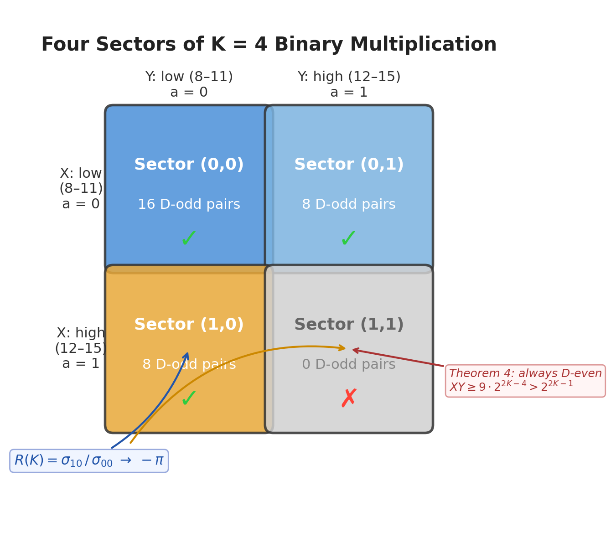
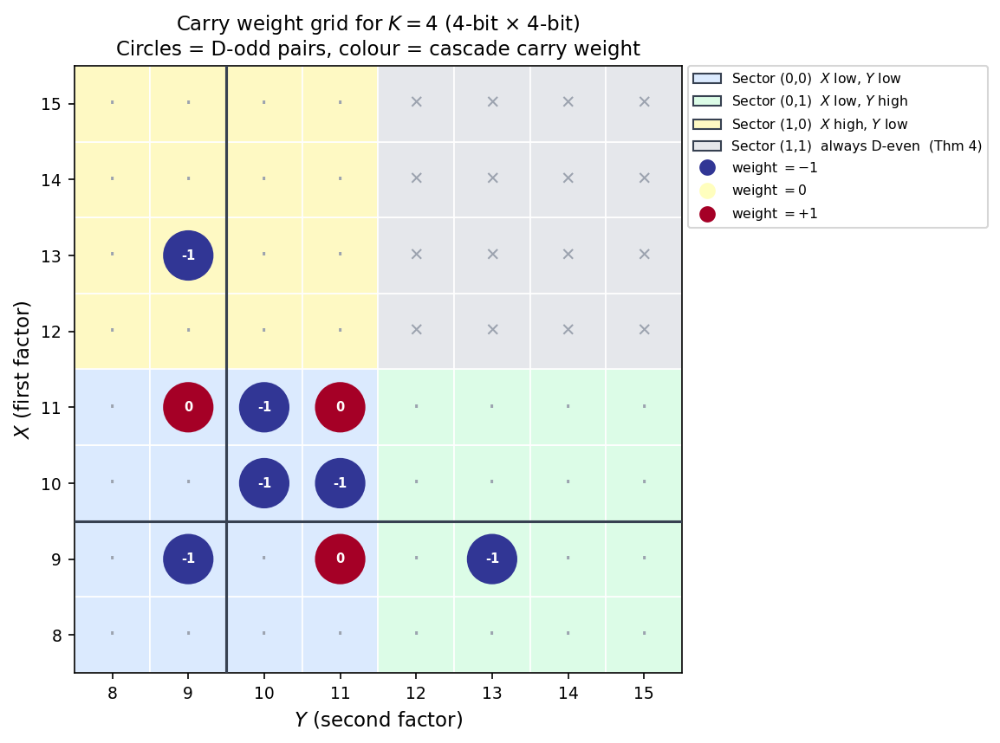
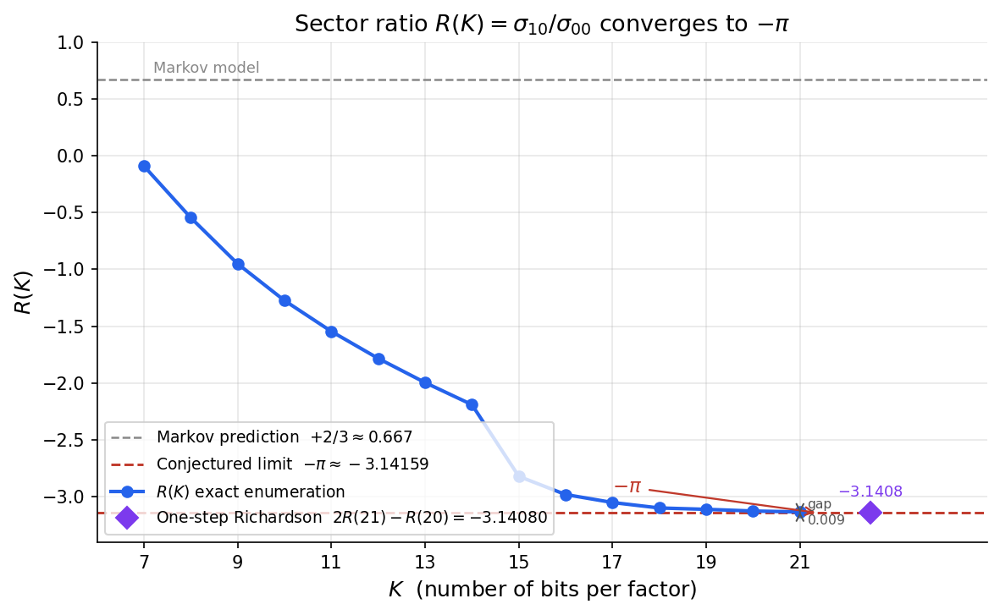
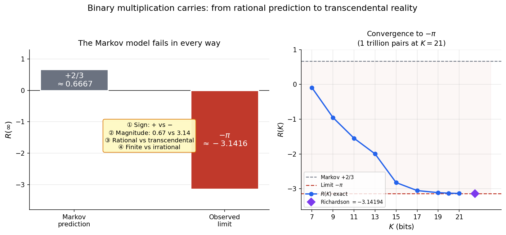

# Reader's Guide: How π Emerges from Binary Multiplication

**Stefano Alimonti** — March 2026

*This guide explains, step by step, how the number π = 3.14159... appears in a problem that has nothing to do with circles. It requires no mathematical background beyond knowing how to multiply.*

---

## 1. Multiplying in Binary

Computers multiply numbers in binary (base 2), using only the digits 0 and 1. The same rules apply as in decimal — multiply each digit, add the columns, carry the overflow.

Here is $13 \times 11 = 143$ in binary:

```
          1 1 0 1          (13 in binary)
        × 1 0 1 1          (11 in binary)
        ---------
          1 1 0 1          13 × 1
        1 1 0 1 ·          13 × 1, shifted left
      0 0 0 0 · ·          13 × 0, shifted left twice
    1 1 0 1 · · ·          13 × 1, shifted left three times
    -----------------
    1 0 0 0 1 1 1 1        (143 in binary)
```

Each column is added up. When a column totals more than 1, the excess is *carried* to the next column — exactly like carrying in decimal addition.

---

## 2. The Carry Chain

Reading the columns from right to left, the column sums and carries for $13 \times 11$ are:

```
Column:      0   1   2   3   4   5   6
Sum:         1   1   1   3   1   1   1
Carry in:    0   0   0   0   1   1   1
Total:       1   1   1   3   2   2   2
Output bit:  1   1   1   1   0   0   0
Carry out:   0   0   0   1   1   1   1
```

The *carry chain* — the sequence 0, 0, 0, 0, 1, 1, 1, 1 — records the overflow at each step. At column 3, the sum exceeds 1 for the first time, and a carry is born. Once present, it persists.

The key insight from probability theory (Diaconis and Fulman, 2009): if the input digits are random, the carry at each position depends only on the *current* carry and the column sum — not on anything earlier. This makes the carry chain a **Markov process**, amenable to spectral analysis.

---

## 3. How Many Digits Does the Product Have?

When we multiply two 4-bit numbers (8 through 15), the product can have either 7 or 8 bits:

- $8 \times 8 = 64$ → 7 bits (1000000)
- $11 \times 11 = 121$ → 7 bits (1111001)
- $12 \times 12 = 144$ → 8 bits (10010000)
- $15 \times 15 = 225$ → 8 bits (11100001)

The boundary is at 128: products below 128 have 7 bits, products at or above 128 have 8 bits.

We call the 7-bit products **D-odd** (the product has an *odd* number of digits, $D = 2K - 1 = 7$). For D-odd products, the carry chain starts and ends at zero — a "bridge" that goes up and comes back down, like a ball thrown into the air.

```
Carry value
    2 ┤
    1 ┤          ╭───╮
    0 ┤──────╮   │   ╰──── 0
             ╰───╯
      0  1  2  3  4  5  6  position
         D-odd carry bridge
```

---

## 4. The Four Sectors

Each 4-bit number has the form $1abc$ in binary. The **second-highest bit** $a$ divides the numbers into two groups:

- **Low group** ($a = 0$): 8, 9, 10, 11 (binary 1000 through 1011)
- **High group** ($a = 1$): 12, 13, 14, 15 (binary 1100 through 1111)

Since we have two numbers $X$ and $Y$, their second bits define four **sectors**:



**A proven fact (Theorem 4):** Sector (1,1) has *zero* D-odd pairs. When both numbers are in the high group, the product always overflows to 8 bits. This is not a coincidence — it holds for all $K$, because if $X \geq 3 \cdot 2^{K-2}$ and $Y \geq 3 \cdot 2^{K-2}$ (both second bits are 1), then $XY \geq 9 \cdot 2^{2K-4} > 2^{2K-1}$, so the product always has $2K$ bits.

---

## 5. The Carry Weight and the Sector Ratio

For each D-odd pair, we read the carry chain and assign a **weight** of $+1$, $0$, or $-1$. The "cascade" method scans the carry chain from top to bottom and reads the carry value $c$ just below the highest nonzero carry position. The weight is $c - 1$: if $c = 0$, the weight is $-1$; if $c = 1$, the weight is $0$; if $c \geq 2$, the weight is positive.

We add up these weights across all D-odd pairs in each sector:
- $\sigma_{00}$ = total weight from sector (0,0)
- $\sigma_{10}$ = total weight from sector (1,0)

The **sector ratio** is their quotient:

$$R(K) = \frac{\sigma_{10}}{\sigma_{00}}$$

This is a purely combinatorial quantity: it counts carry patterns in binary multiplication, weighted by the cascade valuation. No geometry, no circles, no angles.

The figure below shows every pair at $K = 4$. Each circle is a D-odd pair coloured by its carry weight; grey crosses are sector (1,1), always D-even (Theorem 4). The asymmetry between the yellow sector (1,0) and the blue sector (0,0) is what drives $R(K)$ toward $-\pi$.



---

## 6. The Punchline: R(K) Converges to −π

We computed $R(K)$ for every value of $K$ from 4 to 21 by exhaustive enumeration — checking every single pair of $K$-bit numbers. At $K = 21$, this means examining over **one trillion** pairs.



| $K$ | Pairs checked | $R(K)$ | Gap from $-\pi$ |
|-----|--------------|---------|-----------------|
| 7 | 4,096 | $-0.09$ | 3.05 |
| 11 | ~1 million | $-1.55$ | 1.59 |
| 15 | ~270 million | $-2.82$ | 0.32 |
| 19 | ~69 billion | $-3.110$ | 0.032 |
| 21 | ~1.1 trillion | $-3.133$ | 0.008 |
| $\infty$ (extrapolated) | | $-3.1416\ldots$ | $< 0.001$ |

After Richardson extrapolation (a standard acceleration technique), the limit matches $-\pi = -3.14159\ldots$ to **4 significant digits**. Even a single Richardson step using only two consecutive data points — $K = 20$ and $K = 21$ — gives $2R(21) - R(20) = -3.14194$, a 3.5-digit match requiring no fitting.

---

## 7. Why Is This Surprising?

Three things make this result remarkable:

**1. The Markov model is completely wrong.** If carries at each position were independent (the Markov assumption), the sector ratio would approach $R = +2/3$ — a positive rational number. The observed answer instead points toward $-\pi$ — negative, irrational, transcendental. The sign is wrong, the magnitude is wrong by a factor of 5, and the number itself is of a fundamentally different mathematical nature.

**2. π has no reason to be here.** The number π is the ratio of a circle's circumference to its diameter. Our problem involves no circles, no angles, no curves — just binary digits, column sums, and carries. The connection to π is deep: it enters through the Dirichlet character $\chi_4$, which satisfies $L(1, \chi_4) = \pi/4$ (the Leibniz series $1 - 1/3 + 1/5 - 1/7 + \cdots = \pi/4$). The carry chain's spectral structure naturally selects this character.

**3. A sharp phase transition is proposed.** In the LMH model of [E], increasing the correlation between adjacent carries continuously transforms the spectral sum from $+2/3$ (Markov, subcritical) through $0$ (critical point) to $-\pi$ (supercritical). The governing Möbius transformation is

$$S(A) = \frac{2(1-A)}{3-2A}$$

where $A$ measures the strength of digit correlations. Matching this model sum to $-\pi$ gives $A^* = (3\pi + 2)/(2(\pi + 1)) \approx 1.379$. If the physical sector ratio is governed by the LMH, this is the corresponding critical value.



---

## 8. What Is Proved and What Is Conjectured

| Result | Status |
|--------|--------|
| The closed-form Möbius transformation $S(A) = 2(1-A)/(3-2A)$ | **Proved** (Theorem 1) |
| The Markov baseline $R_{\text{Markov}}(L) = +2/3 + O(L^{-2})$ | **Proved** (Theorem 2) |
| The spectral zeta function reproduces $\zeta(2s)$ | **Proved** (Theorem 3) |
| No D-odd pair has sector (1,1) | **Proved** (Theorem 4) |
| The count ratio $N_{10}/N_{00}$ is a closed-form logarithmic constant | **Proved** (Theorem 5) |
| Cascade stopping depths in sector (0,0) obey structural rigidity | **Proved** (Theorem 6) |
| The first nonzero carry is exactly 1 | **Proved** (Theorem 7) |
| $R(\infty) = -\pi$ | **Conjectured** (4.0-digit numerical evidence) |
| The positions of carry-amplitude minima do not shift from $K = 21$ to $K = 999$ | **Confirmed** (§9.5) |

The conjecture reduces to proving two things: (i) a scalar constant equals $-4$, and (ii) the spectral gap $1/2$ is preserved under the D-odd boundary condition. The companion paper [L] now realizes the same stopping-time channel as a canonical weighted first-return resolvent and shows that the current carry-side analytic object captures Euler/local-factor structure but does not yet transfer the $L$-function zeros. The algebraic framework is complete; the remaining step is analytical.

---

## 9. The Bigger Picture

The conjectural limit $R \to -\pi$ is one facet of a broader connection between binary carries and number theory:

- The **Riemann zeta function** $\zeta(s)$, which encodes the distribution of primes, is approximated by ensemble-averaged spectral determinants of carry companion matrices [B].
- The **spectral zeta function** of the Markov carry bridge reproduces $\zeta(2s)$ at all even arguments (Theorem 3 of this paper).
- Conjecturally, the sector ratio converges to $-4L(1, \chi_4) = -\pi$, connecting to the **Dirichlet $L$-function** of the character modulo 4.
- Together, $\zeta(s)$ and $L(s, \chi_4)$ form the **Dedekind zeta function** of the Gaussian integers $\mathbb{Z}[i]$: $\zeta_{\mathbb{Q}(i)}(s) = \zeta(s) \cdot L(s, \chi_4)$.

Binary multiplication, through its carry structure, already produces one factor of this Dedekind zeta function via the carry polynomial ensemble [B], and conjecturally contributes the second through the sector ratio studied here.

---

## Glossary

- **Binary (base 2):** A number system using only digits 0 and 1.
- **Carry:** The overflow when a column sum exceeds the base. In base 2, a column sum of 2 produces a carry of 1.
- **D-odd:** A product whose binary representation has exactly $2K - 1$ digits (an odd number).
- **Sector:** One of four groups determined by the second-highest bit of each factor.
- **Sector ratio $R(K)$:** The ratio of carry-weighted sums in sectors (1,0) and (0,0).
- **Markov process:** A random process where the next state depends only on the current state.
- **Phase transition:** A qualitative change in behavior as a parameter crosses a threshold.
- **Richardson extrapolation:** A numerical technique that accelerates convergence by eliminating leading error terms.

---

## References

1. P. Diaconis, J. Fulman, "Carries, Shuffling, and Symmetric Functions," *Adv. Appl. Math.* 43(2), 176–196, 2009.
2. [A] S. Alimonti, "Spectral Theory of Carries in Positional Multiplication," this series. doi:[10.5281/zenodo.18895593](https://doi.org/10.5281/zenodo.18895593) — [GitHub](https://github.com/stefanoalimonti/carry-arithmetic-A-spectral-theory)
3. [B] S. Alimonti, "Carry Polynomials and the Euler Product," this series. doi:[10.5281/zenodo.18895597](https://doi.org/10.5281/zenodo.18895597) — [GitHub](https://github.com/stefanoalimonti/carry-arithmetic-B-zeta-approximation)
4. [E] S. Alimonti, "The Trace Anomaly of Binary Multiplication," this series. doi:[10.5281/zenodo.18895604](https://doi.org/10.5281/zenodo.18895604) — [GitHub](https://github.com/stefanoalimonti/carry-arithmetic-E-trace-anomaly)

---

*CC BY 4.0*
